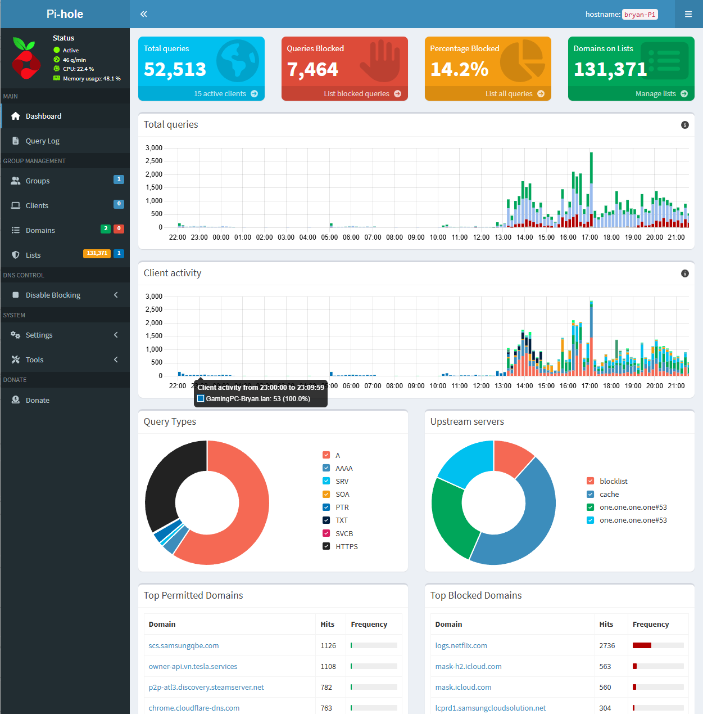

# Pi-hole Network-Wide Ad Blocker: Implementation on Raspberry Pi 5

> **Note:** For security and privacy reasons, all IP addresses, MAC addresses, and hostnames in this documentation have been changed from their actual values. The network configuration principles remain accurate, but the specific addresses shown are examples only.

## Project Overview

This repository documents my implementation of Pi-hole on a Raspberry Pi 5 running Ubuntu 24.04 LTS. The Pi-hole serves as a network-wide ad blocker, providing DNS filtering and DHCP services across my home network connected to an AT&T Fiber router.

## System Specifications


*My Raspberry Pi 5 setup*

- **Hardware**: Raspberry Pi 5 (4GB RAM)
- **Storage**: 64GB microSD card
- **Operating System**: Ubuntu 24.04 LTS (64-bit)
- **Network**: Static IP configuration on Ethernet (eth0)
- **Router**: AT&T Fiber (Nokia BGW320-505)

## Installation Steps

### 1. Update System
```yaml
sudo apt update && sudo apt upgrade -y
sudo apt install curl -y
```

### 2. Install Pi-hole

```yaml
curl -sSL https://install.pi-hole.net | bash
```

### 3. Installation Configuration

- Selected interface: eth0
- Upstream DNS provider: Cloudflare (1.1.1.1)
- Blocklists: Default + StevenBlack's hosts
- Admin web interface: Enabled
- Web server: Enabled
- Query logging: Enabled



Pi-hole admin interface showing statistics and status

### 4. Post-Installation

- Secured admin password
- Enabled DHCP server
- Configured DHCP range: 192.168.1.100-199

## Implementation Process

### 1. Network Configuration

I configured a static IP for the Raspberry Pi using netplan by editing `/etc/netplan/50-cloud-init.yaml`:

```yaml
network:
  version: 2
  ethernets:
    eth0:
      match:
        macaddress: "00:11:22:33:44:55"
      dhcp4: no
      addresses:
        - 192.168.100.10/24
      routes:
        - to: default
          via: 192.168.100.1
      nameservers:
        addresses: [8.8.8.8, 1.1.1.1]
      set-name: "eth0"
```

To prevent configuration overwrites, I disabled cloud-init network management:
```yaml
sudo nano /etc/cloud/cloud.cfg.d/99-disable-network-config.cfg
#Added: network: {config: disabled}
```

I also disabled NetworkManager to prevent conflicts:
```yaml
sudo systemctl stop NetworkManager
sudo systemctl disable NetworkManager
sudo rm /etc/netplan/90-NM-*.yaml
```

### 2. DHCP Configuration

I disabled the DHCP server on the AT&T router to avoid conflicts, then enabled Pi-hole's DHCP server:

- DHCP range: 192.168.100.100 - 192.168.100.199
- Router (gateway): 192.168.100.1
- Local domain name: lan

This configuration allows Pi-hole to assign IP addresses to devices and automatically set them to use Pi-hole for DNS resolution.

### 3. System Monitoring & Optimization

I verified system health with the following metrics:

- Load average: ~1.43-1.68 (higher due to desktop environment)
- Memory usage: ~2GB/4GB RAM used
- Disk space: 47GB free (17% used)
- Temperature: 59.3°C (normal operating range)

Fixed temperature monitoring on Ubuntu 24.04 LTS:
```yaml
sudo mknod /dev/vcio c 100 0
sudo chmod 666 /dev/vcio
#Added persistent udev rule:
echo 'KERNEL=="vcio", MODE="0666"' | sudo tee /etc/udev/rules.d/99-vcio.rules
sudo udevadm control --reload-rules && sudo udevadm trigger
```

*Terminal output showing system load, memory usage, and other health metrics*

## Troubleshooting Challenges & Solutions

### 1. Network Configuration Issues

**Challenge**: Static IP configuration kept being overwritten after reboots.

**Solution**:

- Disabled cloud-init network management
- Removed NetworkManager configuration files
- Ensured systemd-networkd was enabled and running

### 2. DHCP & Routing Conflicts

**Challenge**: Router's DHCP server interfered with Pi-hole DHCP service.

**Solution:**

- Disabled router's DHCP server completely
- Configured Pi-hole to handle DHCP, setting the correct gateway
- Renewed DHCP leases on client devices

### 3. Website Access Issues

**Challenge**: Some streaming services stopped working after Pi-hole implementation.

**Solution:**

- Checked Pi-hole's Query Log to identify blocked domains


*Sample of Pi-hole query log showing blocked and allowed DNS requests*

- Whitelisted essential domains while maintaining ad-blocking for other sites
- Used the following commands to whitelist domains:
```yaml
pihole -w example-streaming-domain.com
pihole -w cdn.example-streaming-domain.com
```

### 4. Pi-hole Not Filtering Locally

**Challenge**: Local commands on the Pi bypassed Pi-hole’s DNS filtering.

**Solution:**

- Verified this is normal behavior—Pi-hole host uses external DNS to avoid loops
- Confirmed all other devices were correctly filtered through Pi-hole

## Performance Verification

I confirmed Pi-hole functionality through several tests:

- Blocking test: `nslookup doubleclick.net 192.168.100.10` returned 0.0.0.0 (confirmed blocking)
- Resolution test: `nslookup google.com 192.168.100.10` properly resolved (legitimate domain)
- Client device test: Verified client devices successfully used Pi-hole for DNS

The Pi-hole Query Log showed active blocking of ad domains from multiple network devices, with most queries receiving responses in less than 10ms.

## Key Achievements

- Successfully configured network-wide ad blocking using Pi-hole
- Implemented custom DNS filtering for enhanced privacy
- Resolved complex network conflicts with AT&T router
- Optimized system performance for Raspberry Pi hardware
- Documented comprehensive troubleshooting procedures

## Skills Demonstrated

Through this project, I demonstrated skills in:

- Linux system administration (Ubuntu configuration, service management)
- Network configuration (static IP, DHCP, DNS, routing)
- Troubleshooting methodology (isolating issues, testing solutions)
- System monitoring and optimization
- Technical documentation

## Future Improvements

Potential enhancements for this setup include:

- Migrating to a lighter OS (Ubuntu Server or Raspberry Pi OS Lite) for better resource efficiency
- Implementing automated backups of Pi-hole configuration
- Fine-tuning blocklists for optimal performance and minimal false positives
- Adding Pi-hole redundancy using a secondary instance

## Resources

- [Official Pi-hole Documentation](https://netplan.readthedocs.io/en/latest/netplan-yaml/)
- [Raspberry Pi Documentation](https://www.raspberrypi.com/documentation/)
- [Ubuntu Netplan Documentation](https://docs.pi-hole.net/)
